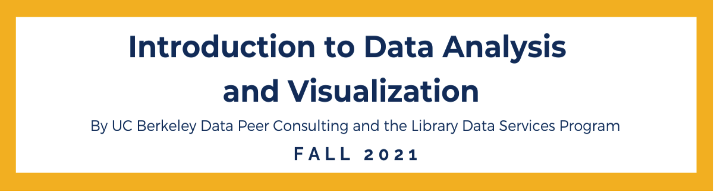

# Intro to Numpy + Pandas Workshop

By: Jillian Criscuolo, Mein Lee, Nayan Chavan, Aashritha Srirambhatla

Workshop Date: 9/29/21

## Workshop Goal(s): 

The goal of this workshop is to cover the fundamentals of numpy and Pandas and give a working knowledge of these two major packages. By the end of the workshop, you should be able to fluently manipulate Numpy arrays, as well as be able to do basic (Excel/SQL style) table operations on data using Pandas.

- Understand the fundamental similarities and differences between Numpy arrays and Python lists as well as when to use one or the other. 
- Apply the basic Pandas data structures as well as the basic table operations onto dataframes 
- Demonstrate the basic workflow for intaking data and exploring it using Numpy and Pandas

## For UC Berkeley Students: [Datahub Link](https://datahub.berkeley.edu/hub/user-redirect/interact?account=ds-peer-consulting&repo=fa21-intro-to-numpy-pandas-workshop&branch=main&subpath=intro-to-numpy-pandas.ipynb)

## For everyone else: 

[Workshop Recording](https://drive.google.com/file/d/1AQPmoz2BrYPrbmwIJhj07rKgxBvAElj-/view?usp=sharing)  
[Transcript of Recording](https://drive.google.com/file/d/160lIlQ3n1LT8ny_kR4MhS61Y_rffw1hJ/view?usp=sharing)
